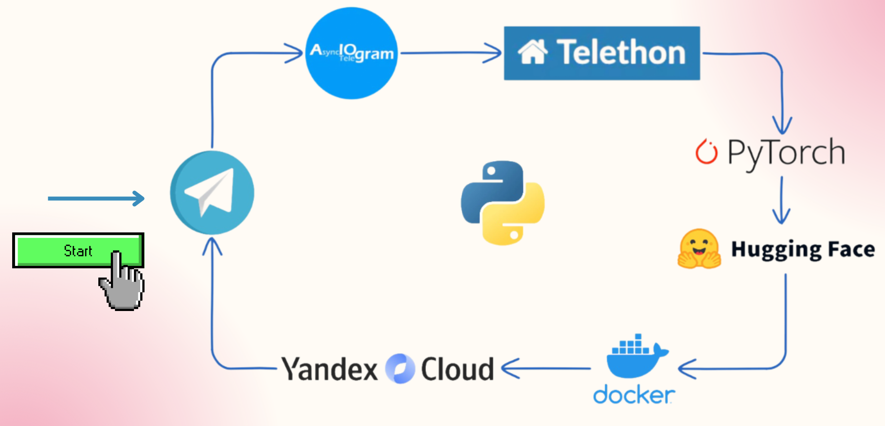

# 📃 What's new?

  

**What's new?** - телеграм-бот, который поможет вам получать краткие сводки самых актуальных новостей в интересующих сферах и избавит от лишнего шума, позволив сфокусироваться только на самом важном.  

Бот соберёт публикации с тех каналов, которые вы укажете и даст вам краткое изложение за выбранный период времени. Вы сможете ознакомиться с ключевыми мыслями публикаций или перейти к их полным версиям, если вас заинтересовало что-то конкретное. 

# 📲 Функционал

Для начала работы бота, необходимо передать ему ссылки телеграм-каналов, которые вы читаете.

Далее, вам будет предоставлен следующий функционал: 

- Классификация постов 

Бот разделяет посты на категории из 9 возможных и предоставляет пользователю
возможность выбирать для чтения сферы, которые ему интересны.

- Ранжирование постов 

Выделит наиболее часто упоминаемые события,
собранные из разных телеграм-каналов, чем поможет пользователю избежать чтения повторяющихся новостей.

- Саммаризация постов

Сократит текст телеграм-поста до его ключевых моментов, выделит и извлечет
только важную и актуальную информацию

<!-- 

  
   

 -->

<!-- Бот доступен по ссылке: https://t.me/TinyNewsBot -->

# 👯 Команда проекта
1. [Вера Великоборец](https://github.com/VerVelVel)
2. [Даша Великохатько](https://github.com/Dasha0203)
3. [Дарина Афанасьева](https://github.com/DarinaSeva)
   

# ⚙️ Стек технологий

  

# 🖥  Используемые модели
Классификация: 
[MoritzLaurer/deberta-v3-large-zeroshot-v2.0](https://huggingface.co/MoritzLaurer/deberta-v3-large-zeroshot-v2.0)

Ранжирование: [paraphrase-multilingual-mpnet-base-v2](https://huggingface.co/sentence-transformers/paraphrase-multilingual-mpnet-base-v2)

Саммаризация:
[SiberiaSoft/SiberianFredT5-instructor](https://huggingface.co/SiberiaSoft/SiberianFredT5-instructor)

